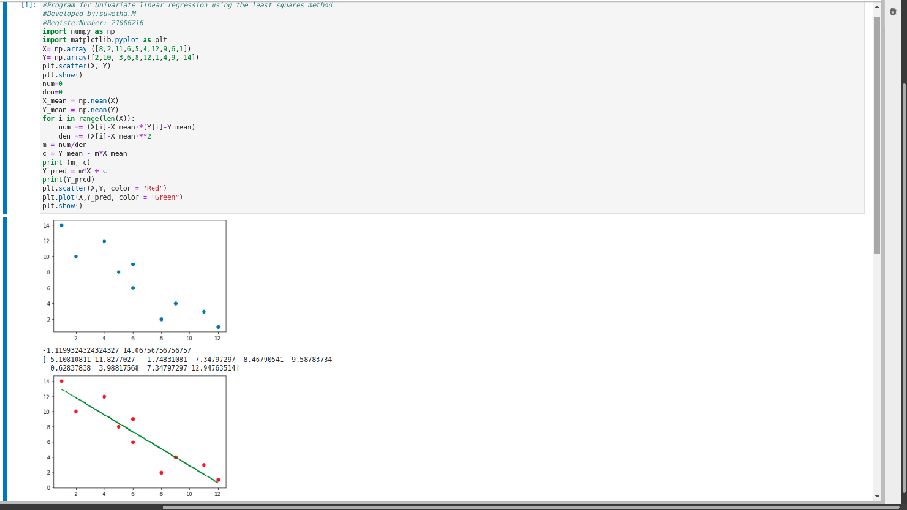

# Implementation of Univariate Linear Regression
## Aim:
To implement univariate Linear Regression to fit a straight line using least squares.
## Equipment’s required:
1.	Hardware – PCs
2.	Anaconda – Python 3.7 Installation / Moodle-Code Runner
## Algorithm:
1.	Get the independent variable X and dependent variable Y.
2.	Calculate the mean of the X -values and the mean of the Y -values.
3.	Find the slope m of the line of best fit using the formula.
 
4.	Compute the y -intercept of the line by using the formula:
  
5.	Use the slope m and the y -intercept to form the equation of the line.
6.	Obtain the straight line equation Y=mX+b and plot the scatterplot.
## Program
```
#Program for Univariate linear regression using the least squares method.
#Developed by:suwetha.M
#RegisterNumber: 21006216
import numpy as np
import matplotlib.pyplot as plt
X= np.array ([8,2,11,6,5,4,12,9,6,1])
Y= np.array([2,10, 3,6,8,12,1,4,9, 14])
plt.scatter(X, Y)
plt.show()
num=0
den=0
X_mean = np.mean(X)
Y_mean = np.mean(Y)
for i in range(len(X)):
    num += (X[i]-X_mean)*(Y[i]-Y_mean)
    den += (X[i]-X_mean)**2
m = num/den
c = Y_mean - m*X_mean
print (m, c)
Y_pred = m*X + c
print(Y_pred)
plt.scatter(X,Y, color = "Red")
plt.plot(X,Y_pred, color = "Green")
plt.show()
```
## Sample Input and Output

## Result
Thus the univariate Linear Regression was implemented to fit a straight line using least squares.
